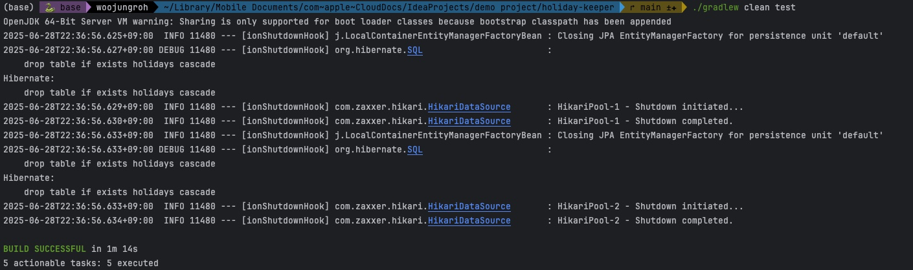

# Holiday Keeper

Nager.Date API를 활용한 전 세계 공휴일 관리 시스템

## 🚀 빌드 & 실행 방법

```bash
# 빌드 & 실행
./gradlew bootRun

# 애플리케이션 접속 확인
curl http://localhost:8080/api/holidays
```

## 🧪 테스트

```bash
# 전체 테스트 실행
./gradlew clean test

# 특정 테스트 클래스 실행
./gradlew test --tests "HolidayServiceTest"
```

## 📖 API 문서 확인
- **Swagger UI**: http://localhost:8080/swagger-ui.html
- **OpenAPI JSON**: http://localhost:8080/api-docs

## 📚 REST API 명세

### 1. 공휴일 조회
```http
GET /api/holidays
```

**파라미터 (모두 선택사항):**
- `countries`: 국가 코드 목록 (쉼표로 구분, 예: KR,US,JP)
- `years`: 연도 목록 (쉼표로 구분, 예: 2024,2025)
- `startDate`: 시작 날짜 (YYYY-MM-DD 형식)
- `endDate`: 종료 날짜 (YYYY-MM-DD 형식)
- `page`, `size`: 페이징 (기본 size=20)

**예시 요청:**
```bash
# 전체 조회
curl "http://localhost:8080/api/holidays"

# 한국 2024년 공휴일 조회
curl "http://localhost:8080/api/holidays?countries=KR&years=2024"

# 날짜 범위 조회
curl "http://localhost:8080/api/holidays?startDate=2024-01-01&endDate=2024-06-30"
```

**응답 예시:**
```json
{
  "content": [
    {
      "id": 4512,
      "date": "2024-01-01",
      "localName": "새해",
      "name": "New Year's Day",
      "country": {
        "code": "KR",
        "name": "South Korea"
      },
      "year": 2024,
      "createdAt": "2025-06-28T21:49:37.004637",
      "updatedAt": "2025-06-28T21:49:37.004638"
    }
  ],
  "pageable": {
    "pageNumber": 0,
    "pageSize": 20
  },
  "totalElements": 15,
  "totalPages": 1
}
```

### 2. 초기 데이터 로딩
```http
POST /api/holidays/initialize
```

최근 5년(2021-2025)의 모든 국가 공휴일 데이터를 외부 API에서 수집하여 저장합니다.

**예시 요청:**
```bash
curl -X POST "http://localhost:8080/api/holidays/initialize"
```

**응답 예시:**
```json
{
  "message": "공휴일 데이터 초기화 완료"
}
```

### 3. 공휴일 동기화 (재동기화)
```http
POST /api/holidays/{countryCode}/{year}/sync
```

특정 국가와 연도의 공휴일 데이터를 외부 API에서 다시 가져와 Upsert 처리합니다.

**예시 요청:**
```bash
curl -X POST "http://localhost:8080/api/holidays/KR/2024/sync"
```

**응답 예시:**
```json
{
  "message": "동기화 완료",
  "changes": 3
}
```

### 4. 공휴일 삭제
```http
DELETE /api/holidays/{countryCode}/{year}
```

특정 국가와 연도의 모든 공휴일 데이터를 삭제합니다.

**예시 요청:**
```bash
curl -X DELETE "http://localhost:8080/api/holidays/KR/2024"
```

**응답 예시:**
```json
{
  "message": "삭제 완료",
  "deletedCount": 15
}
```

### 주요 설계 특징
- **Country 값 객체**: 국가 정보를 별도 테이블로 분리하지 않고 메모리 캐시로 관리
- **JPA Converter**: Country 객체 ↔ country_code 컬럼 간 자동 변환
- **복합 인덱스**: 국가별/연도별 등 검색 성능 최적화
- **연도 컬럼**: 날짜에서 추출하여 별도 저장으로 쿼리 성능 향상

## 🔧 주요 기능

### 1. 자동 초기화
- 애플리케이션 시작 시 자동으로 최근 5년간의 공휴일 데이터 로딩
- 외부 API 장애 시에도 애플리케이션 정상 동작 (에러 로그만 출력)

### 2. 국가 캐시 관리
- **런타임 캐시**: Nager.Date API에서 최신 국가 목록을 가져와 메모리에 캐시
- **폴백 데이터**: API 장애 시 주요 국가 데이터를 기본값으로 사용
- **동적 업데이트**: API 호출 시마다 국가 정보 자동 갱신

### 3. Upsert (재동기화)
외부 API와 동기화 시 기존 데이터와 비교하여:
- **추가**: API에서 새로 제공하는 공휴일
- **수정**: 이름이 변경된 기존 공휴일
- **삭제**: API에서 더 이상 제공하지 않는 공휴일

### 4. 유연한 검색
- **다중 조건 필터링**: 국가, 연도, 날짜 범위 조합 가능
- **페이징 지원**: 대량 데이터 효율적 처리
- **QueryDSL 동적 쿼리**: 조건에 따른 최적화된 쿼리 생성

### 5. 예외 처리
- **GlobalExceptionHandler**: 일관된 에러 응답 형식
- **외부 API 장애 대응**: 연결 실패 시 적절한 HTTP 상태 코드 반환
- **데이터 검증**: 국가 코드, 연도 등 입력값 검증


